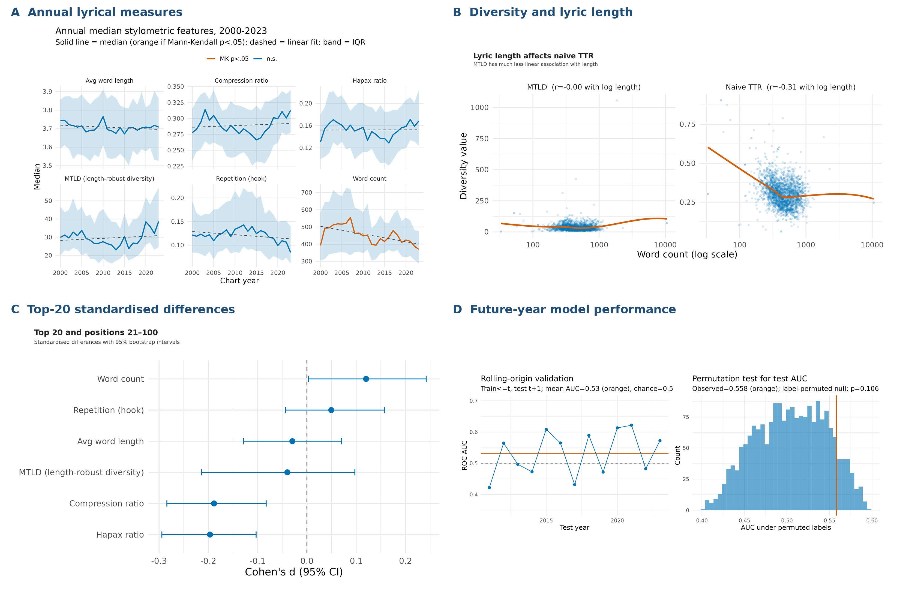

# Billboard Lyrics, 2000–2023: Change, Difference and Predictive Limits

## Data Visualisation

**Question:** How did lyrical structure change across Billboard year-end entries from 2000 to 2023, and can six lyric features distinguish the top 20 from positions 21–100?

This page is a short version of the Data Visualisation report. It uses the same question, data, figures and conclusions. Median lyric word count declined, but the other five features showed no clear monotonic trend. Differences between the two rank groups were small, and the lyric-only model did not provide reliable above-chance discrimination in later years.

## Data and scope

The analysis uses the [Billboard Hot 100 (2000–2023) data with features](https://www.kaggle.com/datasets/suparnabiswas/billboard-hot-1002000-2023-data-with-features). The 3,397 raw rows were collapsed by chart year and rank. There were 791 groups containing multiple source rows, of which 169 contained more than one distinct raw lyric; the first raw lyric was retained as an operational rule. After lyrics with fewer than 20 cleaned tokens were excluded, the final sample contained 2,392 song-year observations, including 477 top-20 entries.

Audio features were left out because 85.7% of their values were missing and 483 of the 486 complete rows came from 2000–2004. Displaying those fields across the full period would have confused missing coverage with change over time. The project therefore uses six lyric features and was completed in R.

*Four R-generated views of lyrical change, measurement, group differences and temporal validation. Top 20 refers to year-end chart rank.*

## What the four panels show

### Panel A: Annual lyrical measures

Yearly medians and interquartile ranges show how six lyric measures changed between 2000 and 2023. Median word count has a Sen's slope of -5.125 cleaned tokens per year and an unadjusted Mann-Kendall p-value of .003. This is a trend in annual medians, not a claim that every individual song loses about five words each year. The other five measures have p-values between .189 and .862 and show no clear monotonic trend. Serial dependence among the 24 annual values was not modelled, so the result needs cautious interpretation.

### Panel B: Diversity and lyric length

Naive type-token ratio is moderately negatively correlated with log word count (r = -.31), which means shorter lyrics can look more diverse simply because they contain fewer opportunities for repetition. Measure of Textual Lexical Diversity (MTLD) has almost no linear correlation with log word count (r approximately .00), although the smoother suggests some nonlinearity. MTLD was therefore used for the main comparisons.

### Panel C: Top-20 standardised differences

The differences between positions 1–20 and 21–100 are small. Top-20 lyrics have a lower hapax ratio (d = -0.197), a lower compression ratio (d = -0.188), and a slightly higher word count (d = 0.120). Every absolute effect is below 0.20. MTLD, mean word length and the content-word concentration proxy are close to zero. The confidence intervals come from a row-level bootstrap that does not group repeated artists or tracks. In the stored figure, **Repetition (hook)** is the display label for the content-word concentration proxy; it does not measure repeated lines.

### Panel D: Future-year model performance

The rolling-origin mean AUC is .532. A model trained on 2000–2018 and tested on 2019–2023 produces an AUC of .558, with a 95% confidence interval of [.488, .625] and a permutation p-value of .107 (unrounded .1065). These results provide only weak evidence that the six lyric features can distinguish later top-20 entries from positions 21–100.

## Overall conclusion

Typical cleaned lyrics became shorter, but the other measured features did not show clear monotonic change. The rank-group differences are small and do not amount to two distinct lyrical profiles. The later-year model also performs close to chance. This is not a general hit-prediction study: every song in the sample had already appeared in a Billboard year-end Hot 100, so the model compares two positions within that chart. The results do not provide a recipe for writing a top-20 song and should not be interpreted causally.

## Design, accessibility and limitations

The composite uses a colour-vision-friendly blue and orange palette, direct titles, written annotations and reference lines. The points and smoother in Panel B also remain distinguishable without colour. However, the significance colour in Panel A is not fully redundant, Panel B contains heavy overplotting, and its logarithmic word-count axis needs explanation. MTLD should always be introduced as Measure of Textual Lexical Diversity. A selectable results table and a fuller semantic description would improve access for screen-reader users.

Eleven observations in the 2019–2023 test period share a track identifier with the training data, so Panel D is an out-of-period test rather than a completely unseen-track test. The data also omit artist reputation, promotion, playlisting, genre and production. The cleaning process removes non-ASCII characters, which may represent multilingual or accented lyrics less faithfully.

## Code

- [`R/01_import_clean.R`](R/01_import_clean.R): import, data-quality checks, lyric cleaning and feature engineering
- [`R/02_explore.R`](R/02_explore.R): trends, group comparisons and Figures 1–3
- [`R/03_model.R`](R/03_model.R): temporal validation and Figures 4–5
- [`R/04_visualise.R`](R/04_visualise.R): four-panel composite
- [`run_all.R`](run_all.R): runs the complete workflow in order
- [Full instructions](README.md#how-to-run-the-project)

[Return to the Introduction to Data Science project page](index.md)
