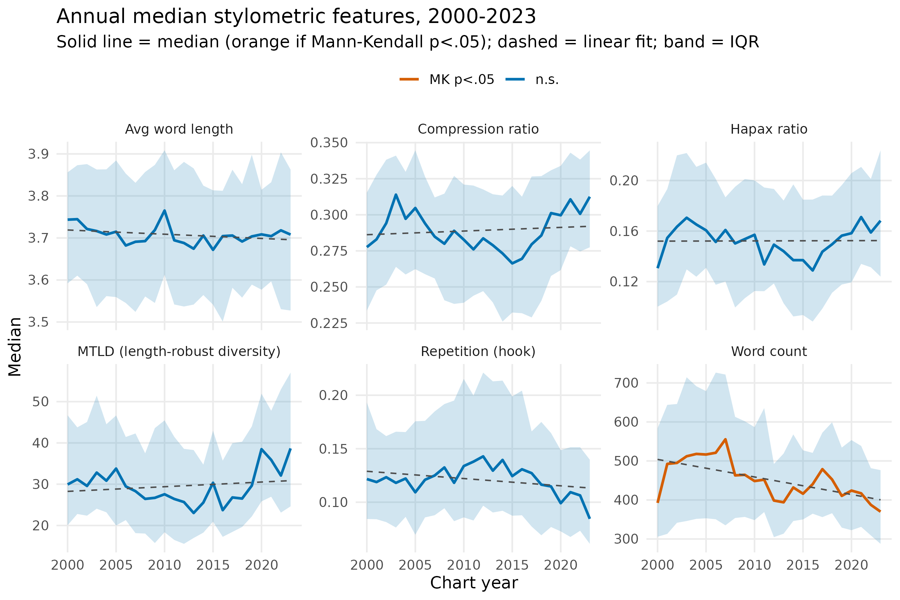
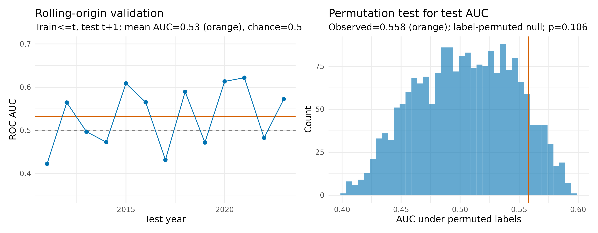

# Billboard Hot 100 lyrics analysis, 2000–2023

## Introduction to Data Science (IJC437)

This project studies the lyrics of songs in the Billboard year-end Hot 100 between 2000 and 2023. It asks whether lyrical structure changed over time, whether top-20 entries differed from positions 21–100, and whether lyric-only features could distinguish later top-20 entries. The source file also contains Spotify fields, but 85.7% of those values are missing and nearly all available audio data comes from 2000–2004. I therefore used the much more complete lyrics rather than presenting an unreliable 24-year audio trend.

## Research questions

1. How did the annual distributions of lyric length, lexical diversity and repetition measures change from 2000 to 2023?
2. How did top-20 songs differ from positions 21–100 on the six lyric measures?
3. How well did those measures distinguish top-20 entries in the later 2019–2023 period?

## Key findings

- Annual median word count fell by an estimated 5.1 cleaned tokens per year. The other five primary lyric measures did not show evidence of a monotonic trend.
- Differences between top-20 songs and positions 21–100 were small. Top-20 entries had slightly lower hapax and compression ratios and slightly higher word counts.
- The logistic model produced a test AUC of 0.558 for 2019–2023. Its bootstrap interval, 0.488–0.625, included 0.50 and the label-permutation p-value was 0.1065. The lyric-only model therefore did not show reliable above-chance discrimination in the later period.

## Code and reproducibility

- [Read the full running instructions](README.md#how-to-run-the-project)
- [Import and cleaning script](R/01_import_clean.R)
- [Exploratory analysis script](R/02_explore.R)
- [Modelling script](R/03_model.R)
- [Visualisation script](R/04_visualise.R)
- [Raw data](data/raw/billboard_24years_lyrics_spotify.csv) and [processed data](data/processed/music_analysis.csv)
- [Four-panel composite](output/figures/data_visualisation_four_panel_composite.png)
- [Validation results](output/tables/rq3_validation.csv)

The project is run from the repository root with `source("run_all.R")`. All paths are relative to the RStudio project, and `set.seed(2024)` is used for the resampling steps.

## Related project

[Data Visualisation project page](data-visualisation.md)
